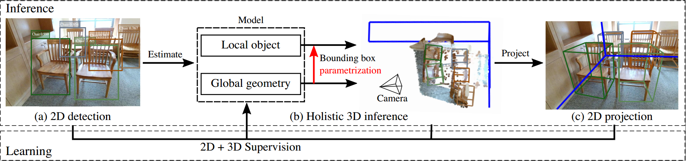

# Cooperative Holisctic Scene Understanding: Unifying 3D Object, Layout, and Camera Pose Estimation 

Created by <a href="http://www.siyuanhaung.com" target="_blank">Siyuan Huang</a>,
					<a href="http://web.cs.ucla.edu/~syqi/" target="_blank">Siyuan Qi</a>,
					<a href="http://yolandaxiao.com/" target="_blank">Yinxue Xiao</a>,
					<a href="http://www.yzhu.io/" target="_blank">Yixin Zhu</a>,
					<a href="http://www.stat.ucla.edu/~ywu/" target="blank">Ying Nian Wu</a>, and
					<a href="http://www.stat.ucla.edu/~sczhu/" target="blank">Song-Chun Zhu</a> from UCLA

## Introduction

This repository contains the code for our NeurIPS 2018 <a href=http://papers.nips.cc/paper/7305-cooperative-holistic-scene-understanding-unifying-3d-object-layout-and-camera-pose-estimation.pdf>paper</a>. 

In this work, we propose an end-to-end model that simultaneously solves all the three scene understanding tasks in realtime
given only a single RGB image, please refer to our <a href=http://siyuanhuang.com/cooperative_parsing/main.html>project page</a> for more details. 

## Citation

If you find our work inspiring or our code helpful in your research, please consider citing:

    @inproceedings{huang2018cooperative,
      title={Cooperative Holistic Scene Understanding: Unifying 3D Object, Layout, and Camera Pose Estimation},
      author={Huang, Siyuan and Qi, Siyuan and Xiao, Yinxue and Zhu, Yixin and Wu, Ying Nian and Zhu, Song-Chun},
      booktitle={Advances in Neural Information Processing Systems},
      pages={206--217},
      year={2018}
    }					

    @inproceedings{huang2018holistic,
      title={Holistic 3D scene parsing and reconstruction from a single RGB image},
      author={Huang, Siyuan and Qi, Siyuan and Zhu, Yixin and Xiao, Yinxue and Xu, Yuanlu and Zhu, Song-Chun},
      booktitle={Proceedings of the European Conference on Computer Vision (ECCV)},
      pages={187--203},
      year={2018}
}

## Install 
    pip install -r requirements.txt
    
## Data
We preprocess the data from SUNRGBD dataset, the clean data can be downloaded from <a href="https://drive.google.com/file/d/1XeCE87yACXxGisMTPPFb41u_AmQHetBE/view?usp=sharing"> here</a>. Put it under metadata/SUNRGBD/Dataset/

The ground truth of SUNRGBD dataset could be downloaded <a href="https://drive.google.com/open?id=1QUbq7fRtJtBPkSJbIsZOTwYR5MwtZuiV"> here</a>. Put it under metadata/SUNRGBD/

To prepare the training data run:
    
    python preprocess/sunrgbd/sunrgbd_process.py
    
## Pretrained Model
We pretrained models for pose/layout estimation and bounding box estimation with the data generated by SUNCG dataset. The pretrained model can be downloaded <a href="https://drive.google.com/open?id=1bkgI8Nprt_aDhS-V2N3srDbNGChJbF-l"> here</a>. Put it under metadata/SUNCG

## Training 
1.  We provide several settings for training the proposed model. The best performance is gained by pretrained on SUNCG dataset and fine-tuned on SUNRGBD dataset which can be run by 
    
        sh scripts/sunrgbd_train_jointnet.sh
    
2. You could also fine-tune the posenet and bdbnet respectively by running
    
        sh scripts/sunrgbd_fine_tune_bdbnet.sh
        
    and 
    
        sh scripts/sunrgbd_fine_tune_posenet.sh
        
3. Train the posenet and bdbnet from scratch by

        sh scripts/sunrgbd_train_bdbnet.sh
        
    and sh scripts/sunrgbd_train_posenet.sh

## Test
Change the model path --model_path_pose and --model_path_bdb in test.py and run it for testing. The results will be saved automatically. It will also compute the 3D IoU and 2D IoU.

Download our trained model from <a href="https://drive.google.com/file/d/1LbhJCxa2OAO4O0GQhrAZZV1KuGAfTrV6/view?usp=sharing">here</a>. Put it under metadata/sunrgbd/models_final
## Evaluation

Download <a href="http://rgbd.cs.princeton.edu/data/SUNRGBDtoolbox.zip">SUNRGBD toolbox</a> and put it under evaluation/SUNRGBDtoolbox

1. Visualization
       
       evaluation/vis/show_result.m

2. Layout estimation
    
        evaluation/roomlayout/layout_evaluate.m
        
3. 3D object detection 
        
        evaluation/detection/script_eval_detection.m
        
4. Holistic scene understanding
        
        evaluation/holisticScene/evaluate_holistic.m

